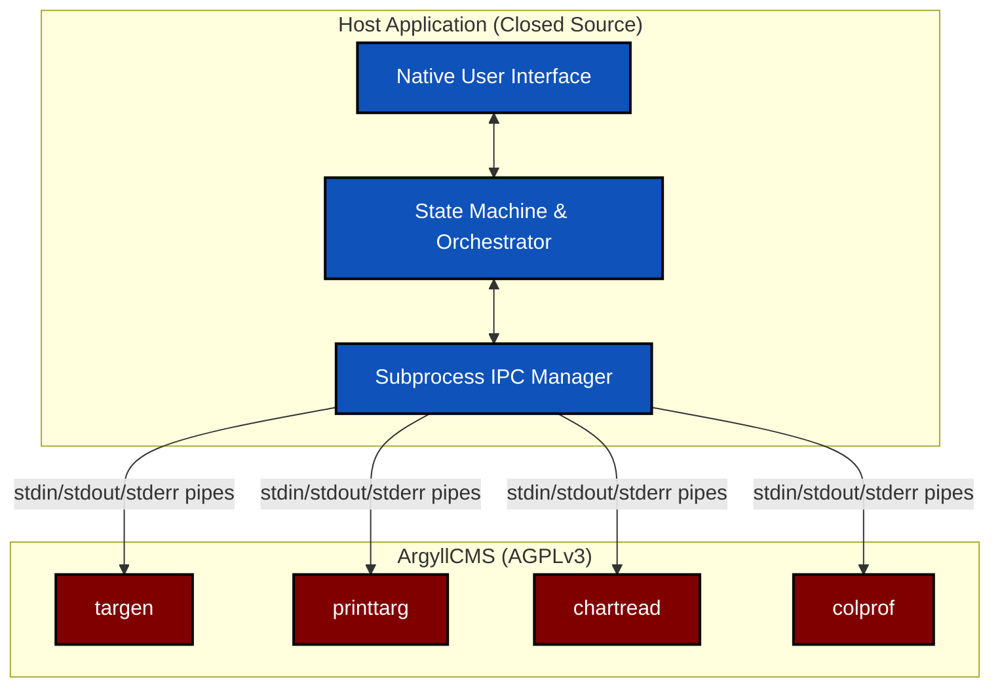
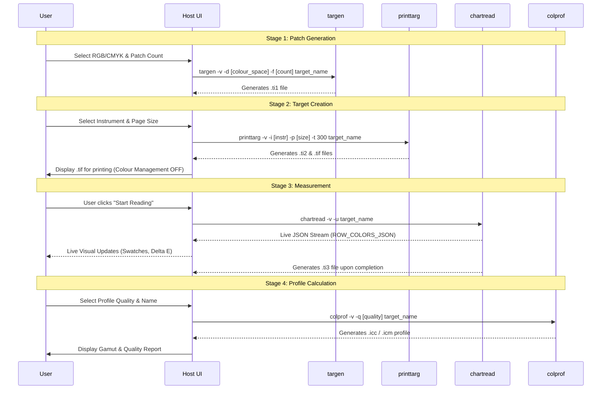
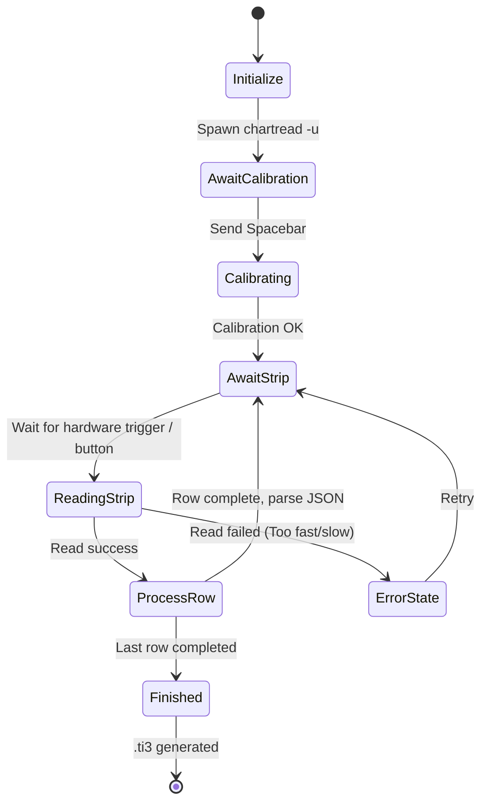

# Printer Profiling UI Project: Comprehensive Requirements & Architecture Roadmap

This document serves as the detailed feature set roadmap and architectural blueprint for integrating ArgyllCMS into a modern, native GUI application specifically dedicated to **Printer Profiling**. The goal is to abstract the complexities of the command-line utilities into a seamless, visual, and user-friendly experience.

---

## 1. Architectural Overview & Licence Boundary

To maintain compliance with the ArgyllCMS AGPLv3 licence whilst allowing the host UI application to be closed-source, a strict inter-process communication (IPC) boundary must be maintained.



### Core IPC Guidelines
1. **No Library Linking**: The host application must never link against `libinst`, `libicc`, or any other Argyll C library.
2. **Subprocess Management**: Binaries must be invoked via OS process spawning (e.g., `std::process::Command` in Rust, `System.Diagnostics.Process` in C#).
3. **Data Passing**: Data is passed via file paths (e.g., `.ti1`, `.ti2`, `.ti3` files) and standard streams (`stdin` / `stdout`).

---

## 2. Technology Stack Recommendations

Given the requirements for a cross-platform (Windows, macOS, Linux), compiled (non-scripted), and closed-source compliant application, the following technology stacks are highly recommended:

1.  **Rust with Tauri, Slint, or Iced**
    *   **Pros**: Compiles to a highly optimised native binary, memory-safe, fearless concurrency for background tasks.
    *   **Licence**: Permissive (MIT / Apache 2.0). Fully safe for closed-source.
2.  **C# with .NET (Avalonia UI or MAUI)**
    *   **Pros**: Strong object-oriented ecosystem, highly productive. Avalonia provides pixel-perfect identical rendering across all OSs.
    *   **Licence**: Permissive (MIT). Fully safe for closed-source.
3.  **C++ with wxWidgets or Qt**
    *   **Pros**: Industry standard for cross-platform C++ UIs. Highly performant.
    *   **Licence**: wxWidgets uses a modified LGPL that permits static linking in closed-source apps. Qt requires dynamic linking under LGPLv3 or purchasing a commercial licence.

*(Note: Scripted frameworks like Python/PyQt and heavy web-wrappers like Electron/React are explicitly excluded per architectural constraints).*

---

## 3. The Complete Profiling Workflow

The application must guide the user through a linear wizard-style process.



---

## 4. Stage 1: Patch Set Creation (`targen`)

The first step is configuring the numerical colour combinations to be printed.

### UI Configuration Details
*   **Printer Colour Space**: Toggle between RGB (Driver-managed) or CMYK (RIP-managed).
    *   *Command flag*: `-d 2` (RGB) or `-d 4` (CMYK).
*   **Total Patch Count**: Controls profile accuracy vs. reading time. Provide presets (e.g., "Draft (400)", "Standard (800)", "High Quality (1500)", "Ultra (2500+)") and a custom input.
    *   *Command flag*: `-f <number>`.
*   **Neutral Axis Boosting**: Inject extra grey/black patches for smoother B&W printing.
    *   *Command flag*: `-e <white_patches> -B <black_patches>`.

### Execution
The UI launches the subprocess and monitors `stderr` for completion.
```bash
targen -v -d 2 -f 800 -e 4 -B 8 my_profile
```

---

## 5. Stage 2: Target Image Generation (`printtarg`)

Once the `.ti1` patch file exists, it is converted into a physical page layout formatted specifically for the user's measurement hardware.

### UI Configuration Details
*   **Hardware Instrument**: Dropdown list of supported devices.
    *   *i1Pro/i1Pro2*: `-i i1`
    *   *ColorMunki*: `-i CM`
    *   *SpyderPrint/SpectroScan*: `-i SS`
*   **Page Size**: Dropdown for media dimensions.
    *   *Command flag*: `-p A4` or `-p Letter`.
*   **Output Format**: Default to high-resolution TIFF for maximum compatibility.
    *   *Command flag*: `-t 300` (8-bit) or `-T 300` (16-bit).

### Execution & Printing Instructions
```bash
printtarg -v -i i1 -t 300 -p A4 my_profile
```
> [!IMPORTANT]
> The UI must explicitly warn the user: **The generated TIFF files MUST be printed with colour management completely disabled in the printer driver.** (e.g., "No Colour Adjustment" on Epson, "Off (No Colour Adjustment)" on Canon). Failure to do so ruins the profile.

---

## 6. Stage 3: Interactive Measurement (`chartread`)

This is the most complex stage for the UI, requiring real-time bi-directional communication with `chartread` utilising the `-u` stream.

### Interaction State Machine


### IPC Mechanics
1. **Stdout Parsing**: The UI reads `stdout` line-by-line.
    *   Lines matching `/^ROW_COLORS_JSON: (.*)/` are parsed as JSON to update the live patch grid and Delta E traffic lights.
    *   Unprefixed lines (e.g., "Hit [Space] to read strip A") trigger state changes in the UI prompt text.
2. **Stdin Injection**: The UI provides buttons (e.g., "Calibrate", "Skip") that inject keystrokes (`" \n"`, `"s\n"`) into the child process's `stdin`.

### Visualising Delta E
For live feedback, the JSON stream contains `expected.Lab` and `measured.Lab`. The UI should:
1.  Implement the **CIEDE2000 ($\Delta E_{00}$)** formula.
2.  Calculate the difference for every patch as it arrives.
3.  Display a traffic light indicator (e.g., Green: $\Delta E < 2$, Amber: $\Delta E < 5$, Red: $\Delta E > 5$) on the UI swatch grid to instantly flag printing or reading errors.

---

## 7. Stage 4: Profile Calculation (`colprof`)

Once reading is finished and the `.ti3` file is generated, the mathematical ICC profile generation begins.

### UI Configuration Details
*   **Profile Quality**: Controls LUT resolution and optimisation passes.
    *   *Command flag*: `-q l` (Low), `-q m` (Medium), `-q h` (High), `-q u` (Ultra). *Note: Ultra can take a very long time.*
*   **Profile Description Name**: The internal name embedded in the ICC file that appears in Photoshop/Lightroom dropdowns.
    *   *Command flag*: `-D "My Profile Name"`.
*   **Algorithm**: Typically `cLUT` for printers.
    *   *Command flag*: `-a l`.

### Execution
This process is highly CPU intensive. The UI must launch this in an asynchronous background thread and display an indeterminate progress spinner.
```bash
colprof -v -q h -a l -D "Canon Pro-100 Luster Paper" my_profile
```

---

## 8. Display of Results & Verification

### Post-Processing Integration
1.  **Mathematical Quality Score (`profcheck`)**:
    Silently execute `profcheck` to compare the generated profile against the measurement data.
    ```bash
    profcheck -k my_profile.ti3 my_profile.icc
    ```
    *Parse the output*: Extract "Peak error" and "Average error". A healthy profile typically has an average $\Delta E$ below 1.5. Display this clearly in the UI.
2.  **3D Gamut Visualisation**: 
    To provide a premium feel, integrate a native 3D WebGL (if using Tauri) or OpenGL (if using C++/C#) viewer. Parse the gamut boundary data to render a rotatable 3D plot of the printer's colour volume in CIELAB space.

---

## 9. Proposed ArgyllCMS Upstream Modifications

To ensure maximum value, stability, and responsiveness in the UI, several low-level features should be developed within the ArgyllCMS codebase. These modifications primarily revolve around structured data output (JSON) to prevent the UI from relying on fragile regex string parsing of human-readable console text.

### 9.1 Implemented Enhancements
*   **`chartread -u` (JSON Streaming)**: *Already developed and merged.* We added the `-u` flag to `chartread`, which emits a real-time, flush-forced `ROW_COLORS_JSON: { ... }` stream. This solved the critical UI requirement of displaying live swatches and computing Delta E ($\Delta E$) mid-measurement without waiting for the `.ti3` file to close.

### 9.2 Recommended Future Enhancements

#### `targen`: Structured Progress
*   **Feature**: Add a `-u` flag to emit JSON progress events during generation (e.g., `{"event": "progress", "stage": "optimising", "percent": 45}`).
*   **Rationale**: Advanced patch generation (especially iterative OFPS with adaptation) can take several minutes. A structured progress stream prevents the UI from appearing frozen.

#### `printtarg`: Structured Target Manifest
*   **Feature**: Add a `-u` flag to output a JSON manifest upon completion, detailing the exact filenames generated (e.g., `target_01.tif`, `target_02.tif`), their physical dimensions, and patch counts per page.
*   **Rationale**: Currently, `printtarg` generates multiple pages implicitly. A UI requires this structured manifest to reliably load and display the correct number of pages for printing without guessing the filenames based on the basename.

#### `colprof`: Structured Profile Calculation Progress
*   **Feature**: Add a `-u` flag to emit JSON progress during profile calculation (e.g., `{"event": "gamut_mapping", "percent": 75}`).
*   **Rationale**: High and Ultra quality profile generation is highly CPU-intensive and time-consuming. Parsing dots (`.`) or numbers from `stdout` for progress bars is unreliable; structured progress ensures smooth UI feedback.

#### `profcheck`: Structured Delta E Report
*   **Feature**: Add a `-u` flag to output the final $\Delta E$ report in JSON format (e.g., `{"peak_de": 2.34, "avg_de": 0.51, "rms": 0.61}`).
*   **Rationale**: The UI currently has to use regex to parse human-readable text (e.g., `errors(CIEDE2000): max. = ...`). A JSON payload guarantees robust extraction of quality metrics.

#### Instrument Enumeration (Global)
*   **Feature**: A flag (e.g., `chartread -u -c list`) to query connected USB instruments and return a JSON array of device ports and names.
*   **Rationale**: Allows the UI to automatically populate the "Select Instrument" dropdown without relying on OS-level USB polling or brittle string parsing of `chartread -?`.

---

## 10. Development Milestones

*   **Milestone 1: Project Scaffolding & State Management**: Build the core host application (Rust/C#/C++) and the non-blocking subprocess invocation abstractions to safely manage AGPL binaries.
*   **Milestone 2: Target Generation Pipeline**: Implement UI forms and validation for Stages 1 & 2 (`targen` and `printtarg`), yielding printable TIFF files.
*   **Milestone 3: Interactive Reading Engine**: Build the state machine, live swatch grid, $\Delta E$ math, and `chartread -u` IPC pipe handler.
*   **Milestone 4: Profiling & Verification**: Implement the `colprof` execution thread and `profcheck` parsing for the final report.
*   **Milestone 5: Advanced Visualisations**: Integrate 3D gamut plotting and UX polish.
