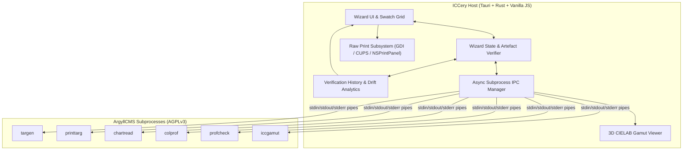

# ICCery 🎨

> Modern, cross-platform native desktop application for printer profiling, powered by ArgyllCMS.

[](https://git.i3omb.com/gronod/ICCery)
[](https://git.i3omb.com/gronod/ICCery)
[](https://tauri.app)
[](LICENCE.md)

**ICCery** is a native GUI frontend designed to make creating custom ICC/ICM printer profiles seamless, visual, and reliable. It wraps the powerful color management capabilities of [ArgyllCMS](https://www.argyllcms.com/) within an intuitive, artefact-gated 5-stage wizard.

---

## Key Features

- 🪄 **Linear 5-Stage Wizard Workflow**:
  1. **Stage 1 — Patch Generation (`targen`)**: Configure RGB (driver-managed) or CMYK (RIP-managed) patch sets with custom counts, profiling presets, neutral/grey axis boosting, and 11 advanced generation parameters with contextual guidance tooltips. Supports direct-resume from existing `.ti2` target files to jump straight to measurement.
  2. **Stage 2 — Target Creation & Raw Printing (`printtarg`)**: Format patch targets for handheld spectrophotometers (i1Pro, i1Pro2, ColorMunki, SpyderPrint) and automated XY tables (i1iO, SpectroScan). View high-resolution downscaled TIFF previews and print directly using native OS unmanaged pathways:
     - **macOS**: Native `NSPrintPanel` driver preferences with automatic ColorSync suppression (`AP_ColorMatchingMode=AP_ApplicationColorMatching`), CUPS media type selection, and driver-specific color adjustment bypass detection (Canon `CNIJIntent2`, Epson `ColorCorrection`, Gutenprint).
     - **Windows**: GDI uncorrected raw printing and DEVMODE preferences.
     - **Linux**: CUPS `raw` queue and PPD media option spooling.
  3. **Stage 3 — Interactive Measurement (`chartread`) & Averaging (`average`)**:
     - **Automated XY Scanning Tables (#93)**: Full automated sequence for GretagMacbeth SpectroScan and X-Rite i1iO tables with multi-line prompt classification, fiducial sight alignment prompts, 4-step sequence checklist UI, and graceful head parking (`q\n`).
     - **Instrument Status Feedback (#204)**: Optional `-Y l` switch support driving the dual RGB ring LEDs of the X-Rite i1Pro 2 (flashing white for calibration, flashing blue for ready/swipe, flashing red for error, flashing green for capture).
     - **Interactive Controls**: Dedicated `Done & Save .ti3` (`d\n`), `Undo Strip` (`u\n`), and `Skip Strip` (`s\n`) actions.
     - **Live Swatch Grid**: 135° diagonally split intended-vs-measured colour patches with live CIEDE2000 ($\Delta E_{00}$) quality indicators, white reference patch preservation, and user-configurable good/warning traffic-light thresholds persisted across sessions.
     - **Noise Reduction**: Multi-pass sheet averaging (`average`) to eliminate spectrophotometer noise.
  4. **Stage 4 — Profile Calculation (`colprof`)**: Generate high-precision cLUT mathematical ICC/ICM profiles with configurable algorithm quality, OBA/FWA compensation (`-f`), illuminant (`-i`) and observer (`-o`) overrides, viewing-condition transforms (`-c`, `-d`), custom ambient spectrum support, descriptions, and copyright tagging.
  5. **Stage 5 — Verification, Drift Analytics & 3D Gamut (`profcheck` + `iccgamut`)**:
     - **Longitudinal Printer Drift Analytics (#95)**: Historical verification logging persisted to `verification_history.json` (up to 1,000 records), an interactive dual-series SVG trend chart with shaded ICCery verification reference bands, consecutive-breach alert recommendation card (detecting drift across distinct dates or $\ge 1$ hour apart), and RFC-4180 compliant CSV export.
     - **Mathematical Accuracy Report**: Peak, Average, and RMS CIEDE2000 metrics with robust parsing of both Argyll JSON summaries (`-u`) and legacy plain-text reports.
     - **Interactive 3D Gamut Viewer**: CIELAB coordinate scaffold with crisp CSS2D labels, per-vertex true-colour profile gamut shading, layer visibility toggles and opacity sliders, camera reset (press **R**), touch controls, and bundled sRGB reference wireframe comparison.
- 📊 **CGATS Dataset Interoperability (#94)**: Native parser for external CGATS and Argyll `.ti3` datasets with canonical normalization (0–255 scaling, field aliasing, metadata synthesis) and direct-jump workflows to Stage 4 (Profile Calculation) and Stage 5 (Verification).
- 📋 **Profiling Presets**: One-click configuration presets (Standard RGB Photo, High-Gamut CMYK Proofing, Fast RGB Draft) with custom preset export/import and security validation.
- 🍎 **macOS Universal Binary**: Native Apple Silicon (`arm64`) and Intel (`x86_64`) support with universal binary bundling and fallback resolution.
- 🐧 **Linux glibc Compatibility**: Pre-built Linux packages compiled with Ubuntu 22.04 LTS compatibility for Debian/Ubuntu environments.
- 🛡️ **Disk Artefact Gating**: Stepper navigation strictly verifies generated artefacts on disk (`.ti1` → `.ti2` → `.ti3` → `.icc`/`.icm`), preventing out-of-order execution while preserving backward navigation.
- 🌐 **Platform-Aware**: Automatic handling of platform profile conventions (`.icm` on Windows, `.icc` on macOS/Linux) and native OS printer subsystems.
- 🎛️ **Standardised UI Design**: Tiered button sizing (`.btn-sm`, `.btn-md`, `.btn-lg`, `.btn-icon-sq`) and consistent action row layouts provide a uniform, responsive interface across all stages.
- ⚖️ **Clean AGPL Boundary**: Complete isolation of AGPLv3 binaries via asynchronous tokio IPC process pipelines.

---

## Architectural Overview

ICCery is built on **Tauri v2** and **Rust**, coupled with a reactive Vanilla JavaScript frontend and **Three.js** WebGL visualization:



---

## Building from Source

### Prerequisites
- [Node.js](https://nodejs.org/) (v18 or newer)
- [Rust](https://www.rust-lang.org/) (1.78+ stable)
- Operating system dependencies:
  - **macOS**: macOS 11.0 (Big Sur) or newer, Xcode Command Line Tools (`xcode-select --install`).
  - **Windows**: Microsoft Visual Studio C++ Build Tools & WebView2 runtime.
  - **Linux (Debian/Ubuntu)**: `libwebkit2gtk-4.1-dev`, `build-essential`, `curl`, `wget`, `file`, `libxdo-dev`, `libssl-dev`, `libayatana-appindicator3-dev`, `librsvg2-dev`, `libcups2-dev`.

### Development Mode
```bash
# Clone the repository
git clone https://git.i3omb.com/gronod/ICCery.git
cd ICCery

# Install frontend dependencies
npm install

# Download ArgyllCMS sidecars for this OS (from github.com/Gronod/argyllcms/releases)
npm run fetch-argyll

# Run the development app
npm run tauri dev
```

> **Notes:**
> - Sidecars are not stored in git; `tauri build` / `tauri dev` will fail until `npm run fetch-argyll` has been run at least once.
> - You can override the downloaded ArgyllCMS release version using `ARGYLL_RELEASE_TAG=vX.Y.Z npm run fetch-argyll`.
> - On Windows, the NSIS installer package bundles the ArgyllCMS USB instrument driver suite and offers an optional driver setup step when run with administrative privileges.

### Production Build
```bash
# Download sidecars (if not already fetched)
npm run fetch-argyll

# Build desktop packages
# - macOS: .dmg / .app bundle (Intel, Apple Silicon, or Universal with --target universal-apple-darwin)
# - Windows: .exe (NSIS) / .msi installer
# - Linux: .AppImage / .deb package
npm run tauri build
```

---

## Licence

The ICCery GUI application is proprietary software licensed under the terms of the [EULA](LICENCE.md). ArgyllCMS binaries and source code are licensed under the GNU Affero General Public License (AGPLv3).
