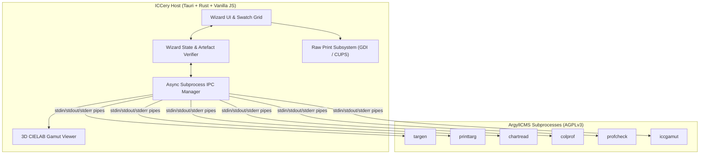

# ICCery 🎨

> Modern, cross-platform native desktop application for printer profiling, powered by ArgyllCMS.

[](https://git.i3omb.com/gronod/ICCery)
[](https://git.i3omb.com/gronod/ICCery)
[](https://tauri.app)
[](LICENCE.md)

**ICCery** is a native GUI frontend designed to make creating custom ICC/ICM printer profiles seamless, visual, and reliable. It wraps the powerful color management capabilities of [ArgyllCMS](https://www.argyllcms.com/) within an intuitive, artefact-gated 5-stage wizard.

---

## Key Features

- 🪄 **Linear 5-Stage Wizard Workflow**:
  1. **Stage 1 — Patch Generation (`targen`)**: Configure RGB (driver-managed) or CMYK (RIP-managed) patch sets with custom counts, profiling presets, and neutral/grey axis boosting.
  2. **Stage 2 — Target Creation & Raw Printing (`printtarg`)**: Format patch targets for spectrophotometers (i1Pro, i1Pro2, ColorMunki, SpyderPrint). View high-resolution downscaled TIFF previews and print directly using native OS raw unmanaged pathways (Windows GDI uncorrected / Linux CUPS `raw`).
  3. **Stage 3 — Interactive Measurement (`chartread`) & Averaging (`average`)**: Instrument auto-detection (`instlist`), real-time calibration prompts, interactive strip reading state machine, live swatch grid with CIEDE2000 ($\Delta E_{00}$) quality indicators, and multi-pass sheet averaging for measurement noise reduction.
  4. **Stage 4 — Profile Calculation (`colprof`)**: Generate high-precision cLUT mathematical ICC/ICM profiles with configurable algorithm quality, descriptions, and copyright tagging.
  5. **Stage 5 — Verification & 3D Gamut (`profcheck` + `iccgamut`)**: Comprehensive mathematical validation report (Peak, Average, RMS $\Delta E$) paired with an interactive 3D CIELAB convex hull color volume viewer, touch controls, and bundled sRGB reference wireframe comparison.
- 📋 **Profiling Presets**: One-click configuration presets (Standard RGB Photo, High-Gamut CMYK Proofing, Fast RGB Draft) with custom preset export/import and security validation.
- 🐧 **glibc Compatibility**: Pre-built Linux packages compiled with Ubuntu 22.04 LTS compatibility for Debian/Ubuntu environments.
- 🛡️ **Disk Artefact Gating**: Stepper navigation strictly verifies generated artefacts on disk (`.ti1`, `.ti2`, `.ti3`, `.icc`/`.icm`), preventing out-of-order execution while preserving backward navigation.
- 🌐 **Platform-Aware**: Automatic handling of platform profile conventions (`.icm` on Windows, `.icc` on Linux/macOS) and native OS printer subsystems.
- ⚖️ **Clean AGPL Boundary**: Complete isolation of AGPLv3 binaries via asynchronous tokio IPC process pipelines.

---

## Architectural Overview

ICCery is built on **Tauri v2** and **Rust**, coupled with a reactive Vanilla JavaScript frontend and **Three.js** WebGL visualization:



---

## Building from Source

### Prerequisites
- [Node.js](https://nodejs.org/) (v18 or newer)
- [Rust](https://www.rust-lang.org/) (1.78+ stable)
- Operating system dependencies:
  - **Windows**: Microsoft Visual Studio C++ Build Tools & WebView2 runtime.
  - **Linux (Debian/Ubuntu)**: `libwebkit2gtk-4.1-dev`, `build-essential`, `curl`, `wget`, `file`, `libxdo-dev`, `libssl-dev`, `libayatana-appindicator3-dev`, `librsvg2-dev`, `libcups2-dev`.

### Development Mode
```bash
# Clone the repository
git clone https://git.i3omb.com/gronod/ICCery.git
cd ICCery

# Install frontend dependencies
npm install

# Download ArgyllCMS sidecars for this OS (from github.com/Gronod/argyllcms/releases)
npm run fetch-argyll

# Run the development app
npm run tauri dev
```

> **Note:**
> - Sidecars are not stored in git; `tauri build` / `tauri dev` will fail until `npm run fetch-argyll` has been run at least once.
> - You can override the downloaded ArgyllCMS release version using `ARGYLL_RELEASE_TAG=vX.Y.Z npm run fetch-argyll`.
> - On Windows, the NSIS installer package bundles the ArgyllCMS USB instrument driver suite and offers an optional driver setup step when run with administrative privileges.

### Production Build
```bash
# Download sidecars (if not already fetched)
npm run fetch-argyll

# Build desktop packages (MSI/NSIS on Windows, DEB/AppImage on Linux)
npm run tauri build
```

---

## Licence

The ICCery GUI application is proprietary software licensed under the terms of the [EULA](LICENCE.md). ArgyllCMS binaries and source code are licensed under the GNU Affero General Public License (AGPLv3).
